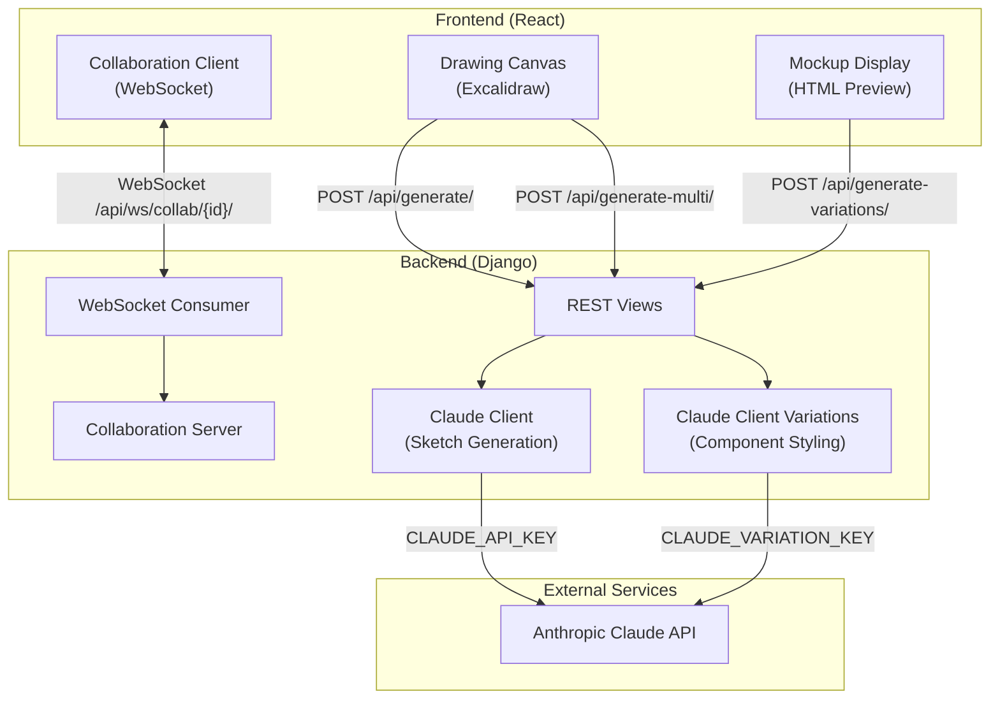

# API Overview

Sketch2Screen provides a REST API for AI-powered sketch-to-code generation and a WebSocket API for real-time collaboration.

## Quick Links

- **[REST API Endpoints](backend-api/rest-endpoints.md)** - HTTP endpoints for sketch generation and component variations
- **[WebSocket API](backend-api/websocket-api.md)** - Real-time collaboration protocol
- **[Internal Services](backend-api/services.md)** - Backend service architecture
- **[Frontend Components](frontend-api/components.md)** - React component reference

## Architecture Overview

Sketch2Screen uses a client-server architecture with real-time collaboration:

## API Categories

### REST API
Three HTTP endpoints for AI-powered generation:
- **`POST /api/generate/`** - Convert a single sketch image to HTML/Tailwind CSS
- **`POST /api/generate-multi/`** - Batch convert multiple sketches (up to 20 pages)
- **`POST /api/generate-variations/`** - Generate design variations for selected UI components

See **[REST API Endpoints](backend-api/rest-endpoints.md)** for detailed request/response formats.

### WebSocket API
Real-time collaboration over WebSocket:
- **Connection** - Join collaboration sessions at `/api/ws/collab/{collabID}/`
- **Scene Sync** - Broadcast drawing changes to all collaborators
- **Page Management** - Synchronize page create/rename/delete operations

See **[WebSocket API](backend-api/websocket-api.md)** for the complete protocol specification.

### Internal Services
Backend services that power the API:
- **Claude Client** - Sketch-to-HTML generation using Anthropic's Claude (15k token limit)
- **Claude Client Variations** - Component variation generation (4k token limit)
- **Collaboration Server** - In-memory session and state management
- **WebSocket Consumer** - Real-time message routing

See **[Internal Services](backend-api/services.md)** for implementation details.

## Key Features

### Dual API Key Architecture
The backend uses two separate Anthropic API keys:
- **`CLAUDE_API_KEY`** - Main sketch-to-code generation (higher token usage)
- **`CLAUDE_VARIATION_KEY`** - Component variations (lower token usage)

This separation allows for better cost management and rate limit distribution.

### AI Model Configuration
- **Model**: `claude-haiku-4-5-20251001` (fast, cost-effective)
- **Max Tokens**: 15,000 (sketch generation), 4,000 (variations)
- **Input**: PNG images up to 10MB
- **Output**: Production-ready HTML with Tailwind CSS

### Security Model
- **Development Mode**: No authentication required
- **CSRF**: Disabled for API endpoints (`@csrf_exempt`)
- **CORS**: Enabled for cross-origin requests
- **File Validation**: Images only, 10MB limit
- **WebSocket**: Unauthenticated connections

**Production considerations documented in [REST API Endpoints](backend-api/rest-endpoints.md).**

## Error Handling

All REST endpoints return JSON errors with `detail` field. Common HTTP status codes:
- `200` - Success
- `400` - Invalid request (missing fields, wrong type, invalid count)
- `413` - File too large (>10MB)
- `500` - AI generation failure or server error

WebSocket errors are logged server-side. See [WebSocket API](backend-api/websocket-api.md) for details.

## Next Steps

Choose a section to explore:
- **[REST API Endpoints](backend-api/rest-endpoints.md)** - Complete endpoint reference with examples
- **[WebSocket API](backend-api/websocket-api.md)** - Real-time collaboration protocol
- **[Internal Services](backend-api/services.md)** - Backend architecture and services
- **[Frontend Components](frontend-api/components.md)** - React component API
