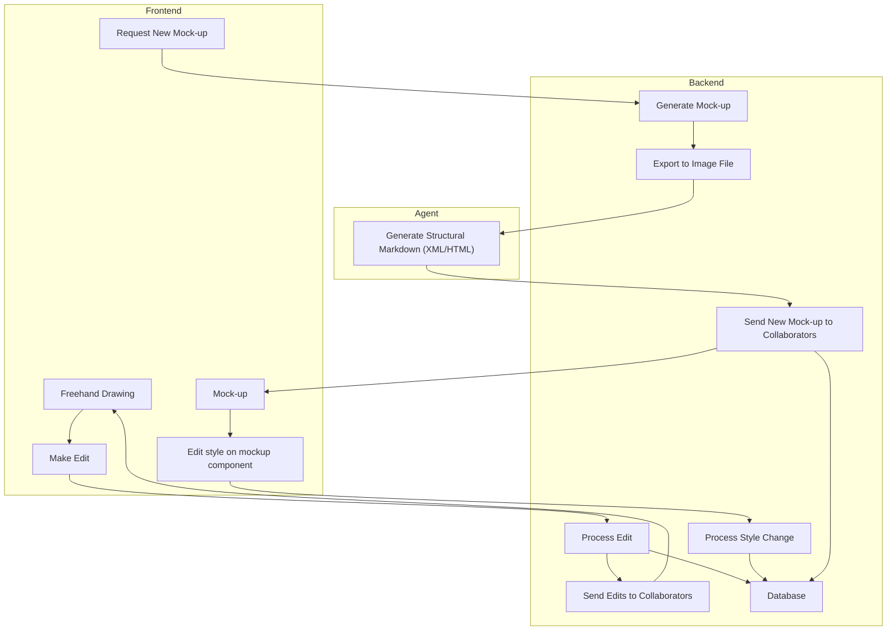

# System Block Diagram

The following block diagrams displays the rough architecture of the project, including secondary features such as collaboration, storage, and user style overrides.

## Mermaid Format

## Manually Drawn

