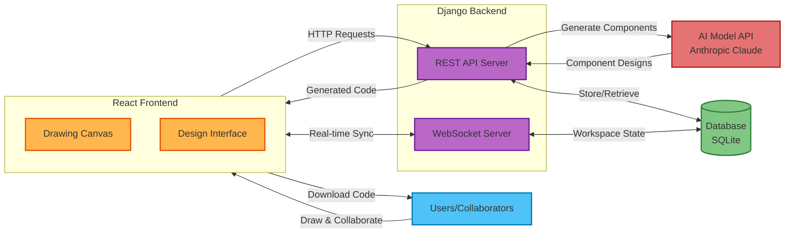

# System Block Diagram

**Figure 1.** High-level architecture of the Sketch2Screen application.

## Description

Sketch2Screen is built with a client-server architecture that enables real-time collaboration and AI-powered design generation. The frontend, built with React, is where users interact with the application through a drawing canvas and design interface. Users can sketch UI components, arrange layouts, and export code directly from their browser.

The backend consists of a Django server with two main components: a REST API server that handles requests for AI generation, component selection, and code export, and a WebSocket server that manages real-time collaboration features. When a user draws on the canvas, those changes are instantly synchronized across all collaborators through WebSocket connections. The system integrates with Anthropic's Claude API to analyze sketch images and generate HTML/CSS component designs.

All workspace data, including sketches, generated components, and design layouts, are persisted in a SQLite database, allowing users to save their work and return to it later via a shareable workspace link. The final output is production-ready code in various frameworks (HTML/CSS, React, Vue, etc.) that users can download and integrate directly into their projects.

