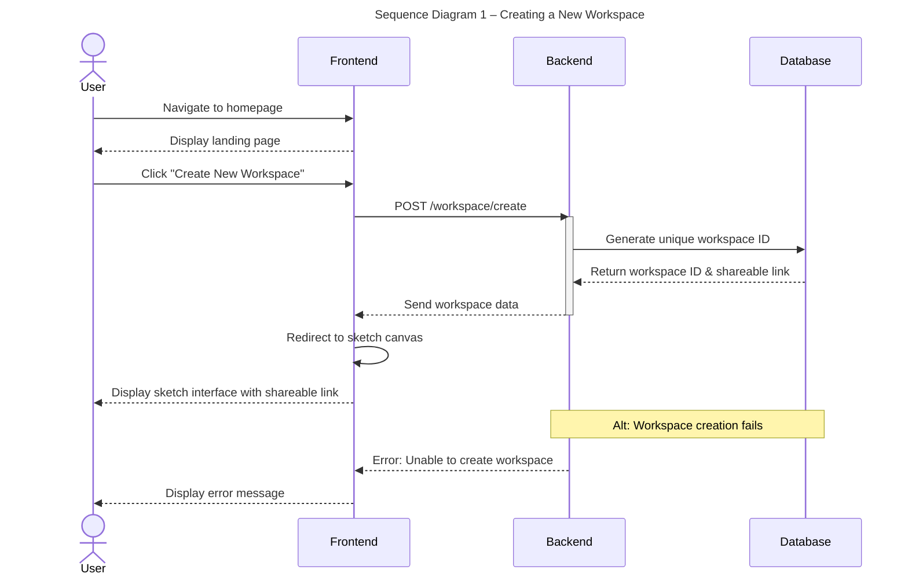
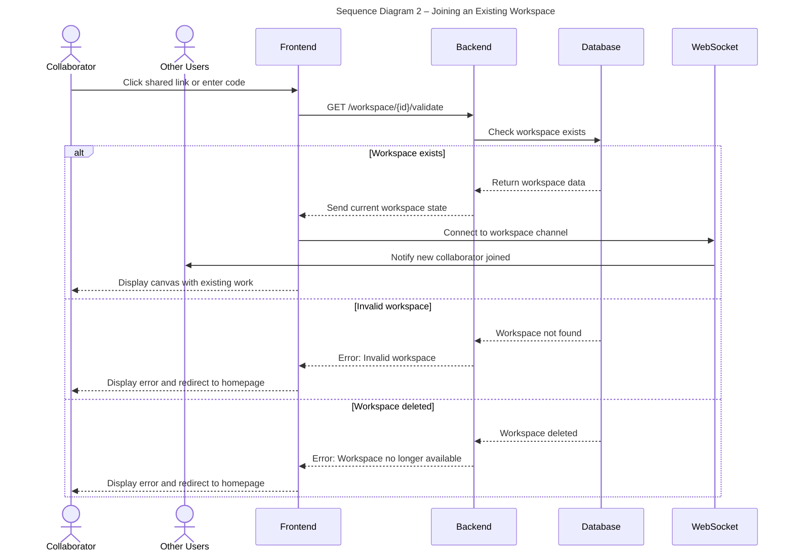
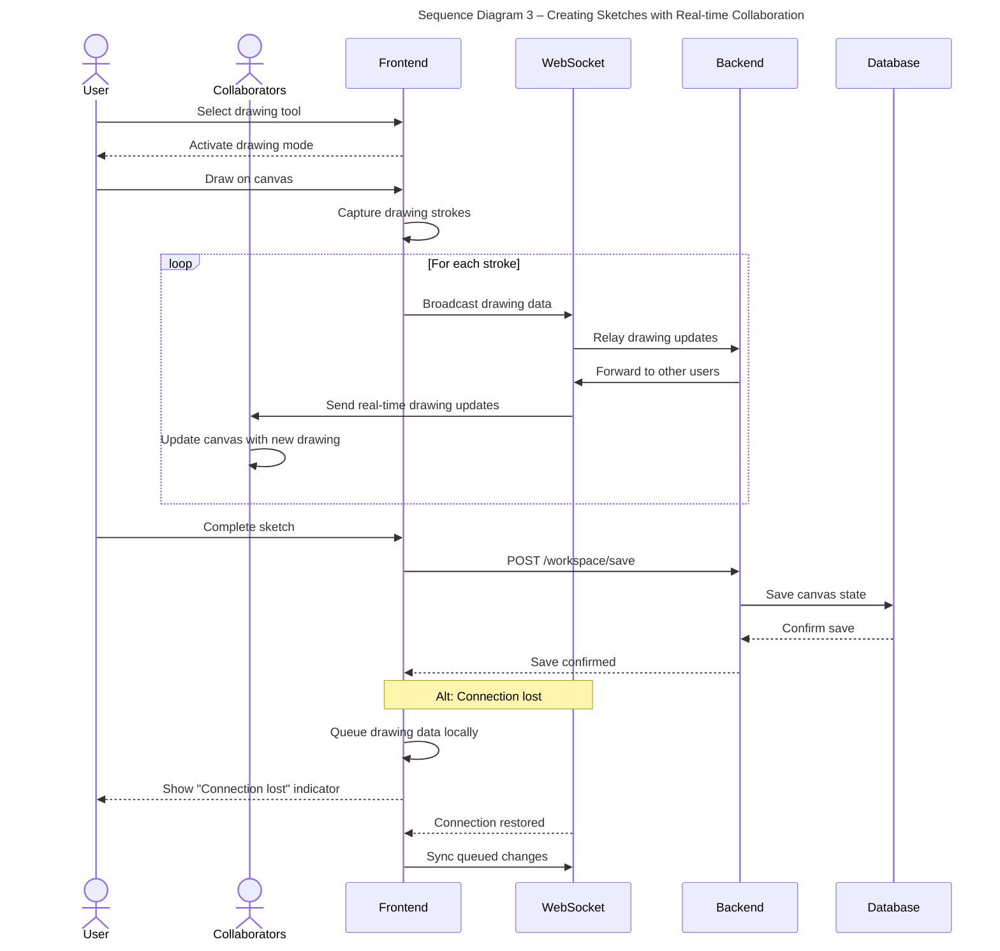
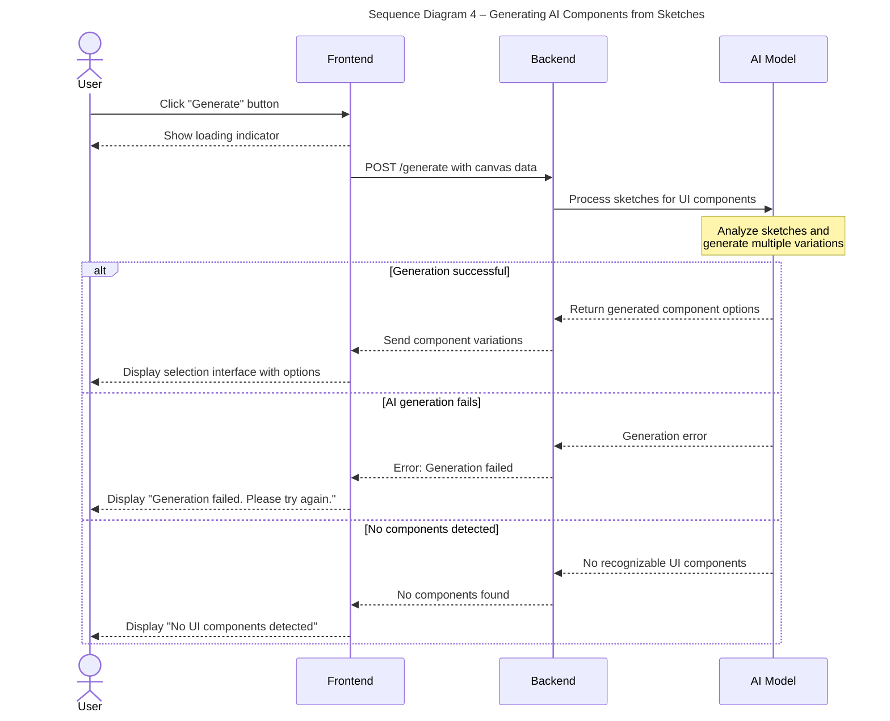
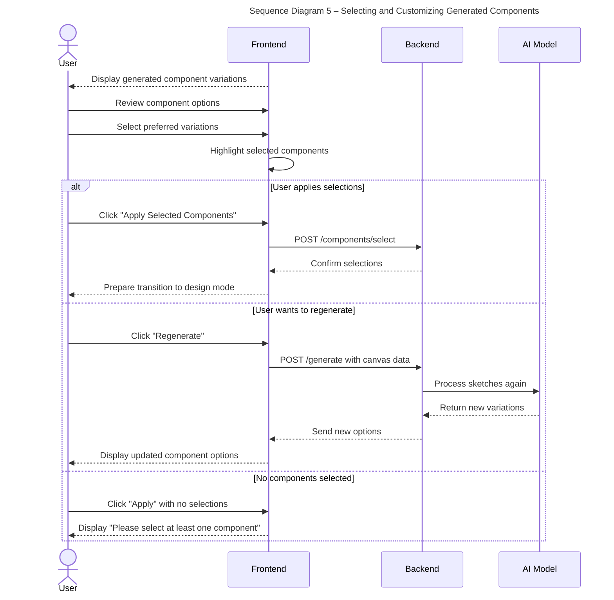
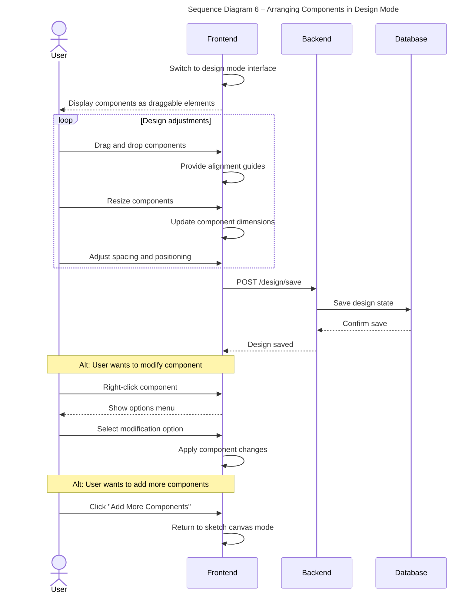
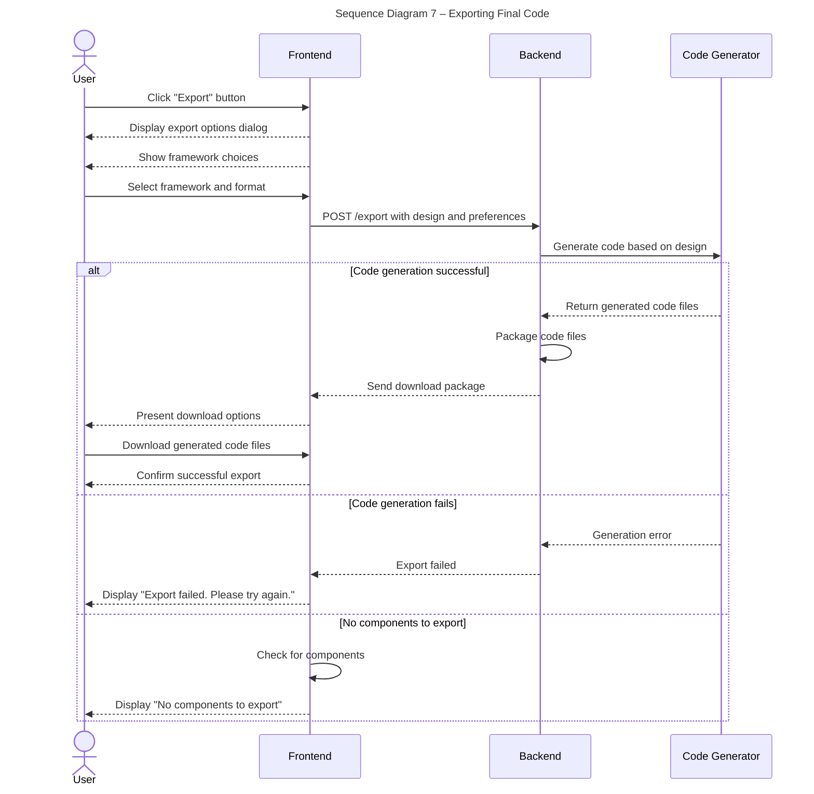
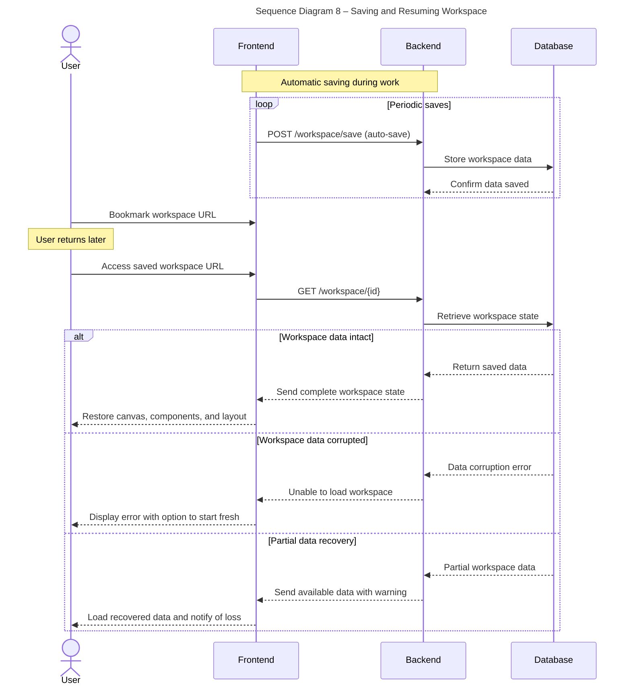

# Sequence Diagrams

## Use Case 1: Creating a New Workspace
*As a user, I want to create a new workspace to start sketching my website design*

1. User navigates to the Sketch2Screen application homepage
2. User clicks "Create New Workspace" button
3. System generates a unique workspace ID and shareable link
4. System redirects user to the sketch canvas interface with drawing tools
5. System displays the shareable workspace link/code for collaboration

## Use Case 2: Joining an Existing Workspace
*As a collaborator, I want to join a workspace using a shared link so I can work with my team*

1. User receives workspace link or code from workspace creator
2. User clicks on shared link or enters workspace code on homepage
3. System validates the workspace link/code
4. System loads the existing workspace with current canvas state
5. User sees the current sketch canvas and any existing work from other collaborators
6. System notifies other active users of the new collaborator joining

## Use Case 3: Creating Sketches with Real-time Collaboration
*As a user, I want to draw UI components on the canvas and see my teammates' drawings in real-time*

1. User selects drawing tool from toolbar (pen, shapes, text, etc.)
2. User draws UI component sketches on canvas
3. System captures drawing strokes and broadcasts updates to all active collaborators
4. Other users see drawing updates appear on their canvas immediately
5. User completes sketch
6. System automatically saves current canvas state

## Use Case 4: Generating AI Components from Sketches
*As a user, I want to convert my sketches into professional UI components using AI*

1. User completes sketching UI components on canvas
2. User clicks "Generate" button
3. System displays loading indicator
4. System processes canvas sketches and sends to AI model
5. AI model analyzes sketches and generates multiple UI component variations
6. System displays generated component options in selection interface
7. User reviews the multiple variations for each sketch element

## Use Case 5: Selecting and Customizing Generated Components
*As a user, I want to choose my favorite design variations from the AI-generated options*

1. System displays multiple variations for each identified sketch element
2. User reviews all component options
3. User clicks to select preferred version of each component
4. System highlights selected components
5. User clicks "Apply Selected Components" to confirm selections
6. System prepares to transfer selected components to design page

## Use Case 6: Arranging Components in Design Mode
*As a user, I want to arrange the selected components into a complete page layout*

1. System switches to design mode interface
2. System displays selected components as draggable elements on design canvas
3. User drags and drops components to arrange layout
4. System provides alignment guides and snap-to-grid functionality
5. User resizes components as needed using drag handles
6. User adjusts spacing and positioning until satisfied with layout
7. System saves current design state

## Use Case 7: Exporting Final Code
*As a user, I want to export my design as usable code for different frameworks*

1. User completes design arrangement
2. User clicks "Export" button from design interface
3. System displays export options dialog with framework choices
4. User selects desired framework and export format
5. System generates code based on current design layout
6. System packages code files and presents download options
7. User downloads generated code files
8. System confirms successful export

## Use Case 8: Saving and Resuming Workspace
*As a user, I want to save my work and return to it later*

1. System automatically saves workspace state periodically during work
2. User bookmarks or saves the workspace URL for later access
3. User returns to the saved workspace URL at a later time
4. System loads saved workspace state including sketches, selected components, and design layout
5. User can continue working from where they left off

