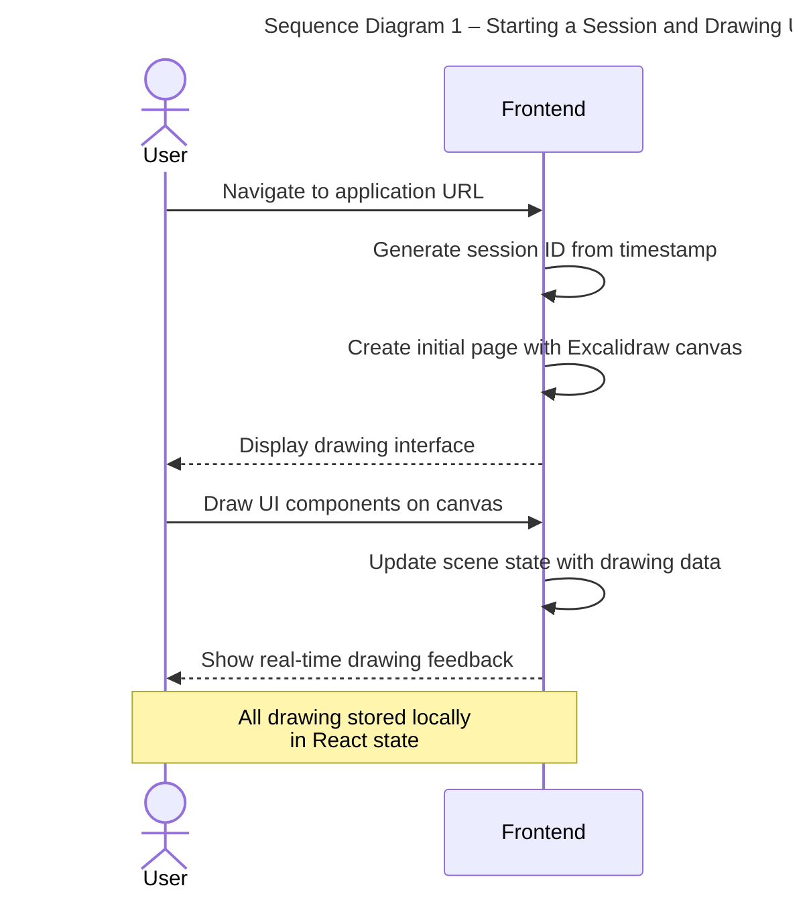
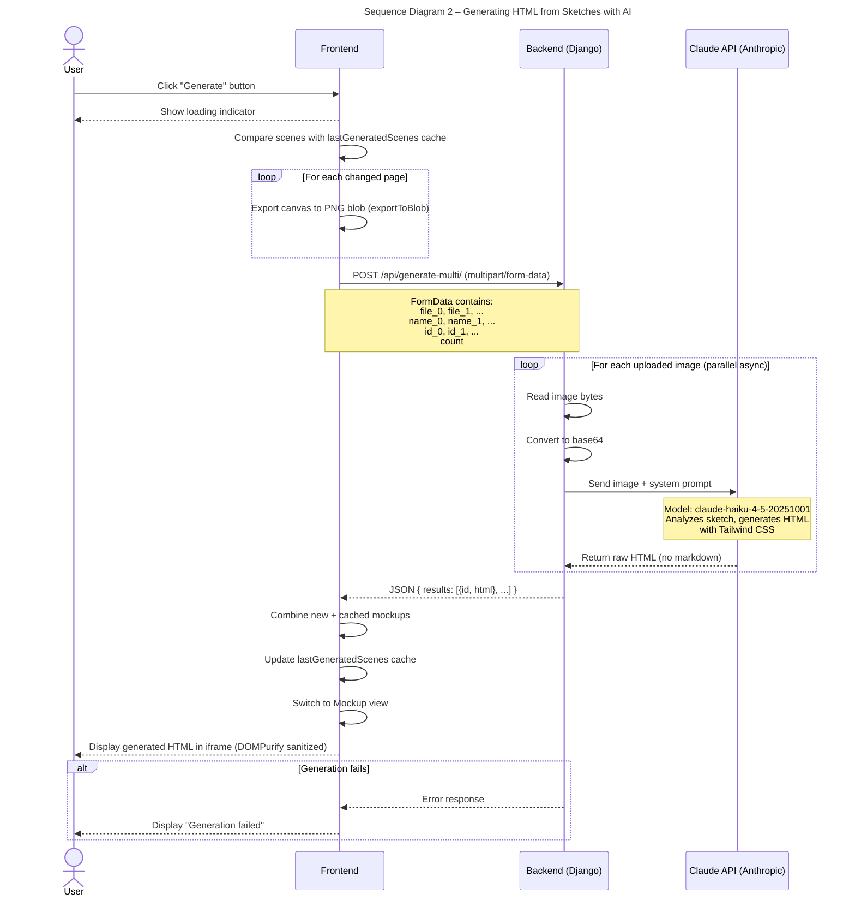
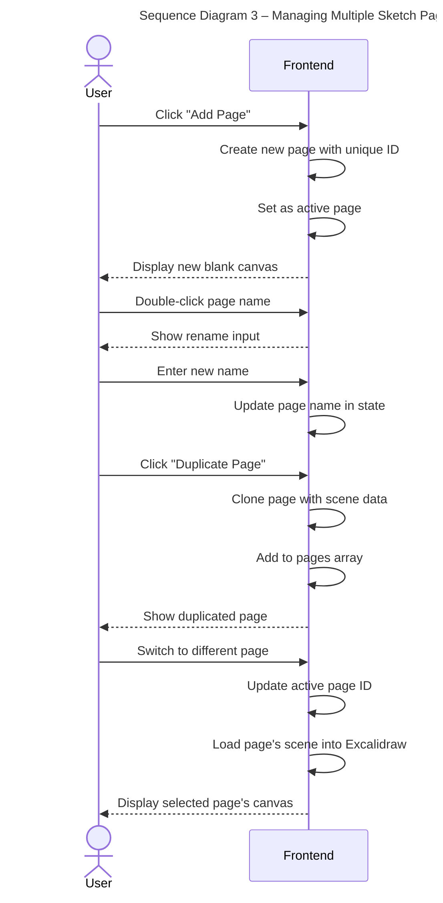
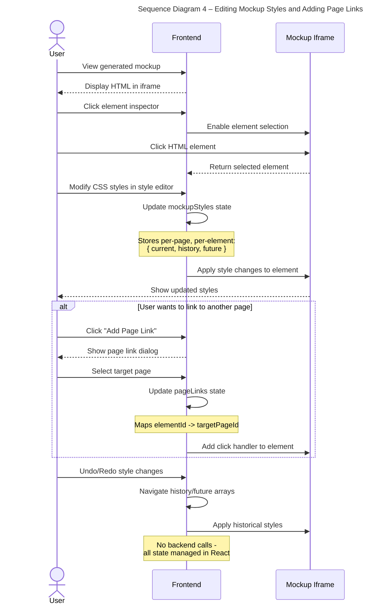
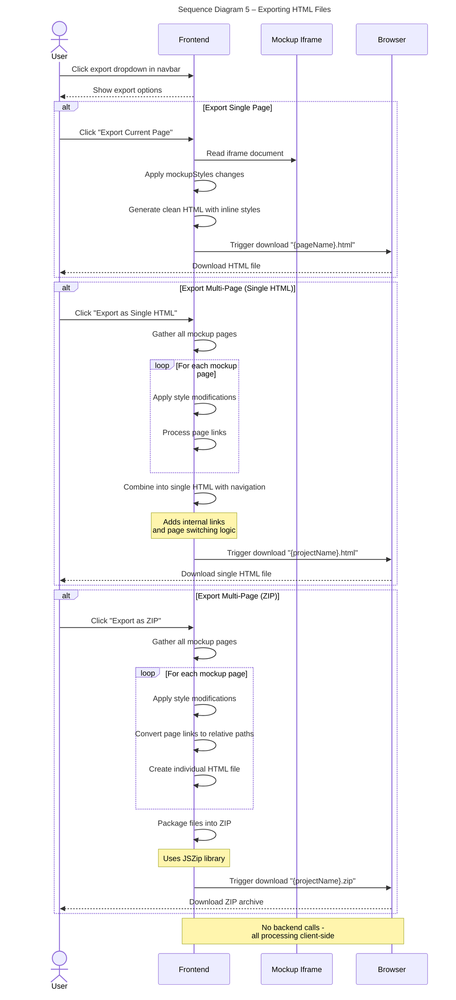
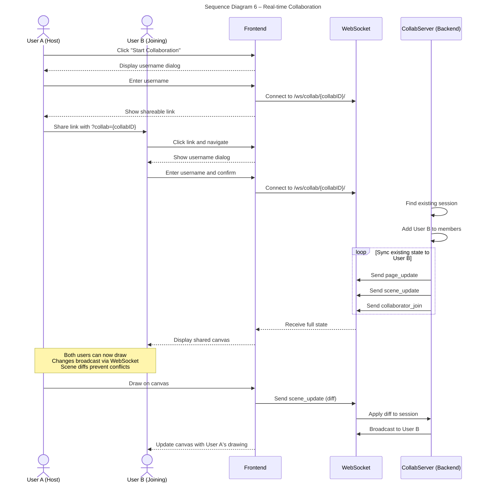

# Sequence Diagrams

## Use Case 1: Starting a Session and Drawing UI Sketches
*As a user, I want to start sketching UI components for my website*

1. User navigates to the Sketch2Screen application URL
2. Frontend generates unique session ID and creates initial page
3. User sees Excalidraw canvas interface with drawing tools
4. User draws UI components (buttons, forms, navigation, etc.) on canvas
5. Frontend tracks all drawing changes in local state

## Use Case 2: Generating HTML from Sketches with AI
*As a user, I want to convert my sketches into production-ready HTML using Claude AI*

1. User clicks "Generate" button in navbar
2. Frontend shows loading indicator
3. Frontend checks which pages have changed since last generation (smart caching)
4. For each changed page, frontend exports canvas to PNG via Excalidraw API
5. Frontend sends multipart/form-data to `/api/generate-multi/` with all page images
6. Backend processes each image in parallel using asyncio
7. Backend converts PNG to base64 and sends to Claude API
8. Claude analyzes sketch and returns raw HTML with Tailwind CSS
9. Frontend receives HTML for each page and displays in sanitized iframe
10. Frontend caches scene state to avoid regenerating unchanged pages next time

## Use Case 3: Managing Multiple Sketch Pages
*As a user, I want to create multiple pages for a multi-page website design*

1. User clicks "Add Page" button in sidebar
2. Frontend creates new page and switches to it
3. User can rename pages by double-clicking page name
4. User can duplicate pages to reuse design
5. User can delete pages (minimum 1 page required)
6. User can switch between pages to work on different screens

## Use Case 4: Editing Mockup Styles and Adding Page Links
*As a user, I want to customize the generated HTML and link pages together*

1. User views generated mockup in iframe
2. User clicks element inspector to select HTML element
3. User modifies CSS styles (colors, sizes, spacing, etc.)
4. Frontend tracks style changes in `mockupStyles` state with undo/redo history
5. User can link elements to other pages via link dialog
6. Frontend stores page links in `pageLinks` state mapping elementId to target pageId
7. Changes are applied immediately in iframe and persisted for export

## Use Case 5: Exporting HTML Files
*As a user, I want to export my generated mockups as HTML files*

1. User clicks export option from navbar dropdown
2. User chooses export format: single page, multi-page single HTML, or multi-page ZIP
3. Frontend reads iframe content and applies all style modifications
4. Frontend processes page links to enable navigation between pages
5. System generates download with all customizations applied
6. User receives HTML file(s) ready to deploy

## Use Case 6: Real-time Collaboration
*As a collaborator, I want to join an existing session and edit together*

1. User A clicks "Start Collaboration" and shares link with `?collab={collabID}` parameter
2. User B clicks the link and enters username when prompted
3. Frontend connects to WebSocket at `/ws/collab/{collabID}/`
4. Backend syncs existing pages and collaborators to User B
5. Both users can now draw and see each other's changes in real-time
6. Collaborator cursors are shown (filtered by active page)

